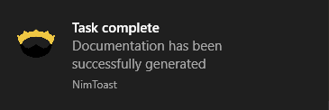

# Toast

A nim package for Windows 10 toast notifications.



## Contents

- [Toast](#toast)
  - [Contents](#contents)
  - [Installation](#installation)
  - [Usage](#usage)

## Installation

`nimble install toast`

## Usage

```Nim
import toast

when isMainModule:
  let
    iconPath = "absolute\\path\\to\\icon"
    n = newNotification("NimToast", iconPath)
  n.show("Task complete", "Documentation has been successfully generated")
```
**Warning:** does not work if the path to the icon does not exist.
